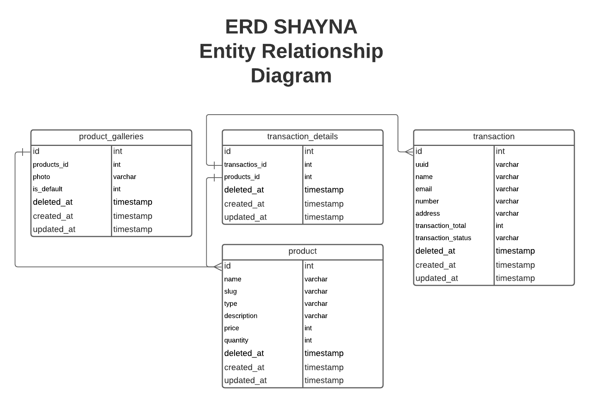

# SHAYNA BACKEND LARAVEL

## DATABASE
database mysql dijalankan di atas docker dengan konfigurasi docker-compose.yml sebagai berikut :
1. docker-compose.yml
    ```yml
    # docker-compose.yml
    version: '3'
    services:
    database:
        image: postgres:latest # use latest official postgres version
        env_file:
        - database.env # configure postgres
        volumes:
        - ./postgres-data:/var/lib/postgresql/data
        ports:
        - 5432:5432
    ```
2. database.env
    ```js
    # database.env
    POSTGRES_USER=bwa_laravue
    POSTGRES_PASSWORD=bwa_laravue_password
    POSTGRES_DB=bwa_laravue_shayna
    ```
3. run service : `docker-compose up -d`

2. Entity Relationship Diagram
    - ERD menggunakan app.lucidchart.com
        <p align="center">
            
        </p>
    - Tabel Product : `php artisan make:migration create_products_table --create=products`
    - Tabel Galeri Produk : `php artisan make:migration create_product_galleries_table --create=product_galleries`
    - Tabel transaction : `php artisan make:migration create_transactions_table --create=transactions`
    - Tabel transaction_details : `php artisan make:migration create_transaction_details_table --create=transaction_details`

3. auth admin
    - `composer require laravel/ui --dev`
    - `php artisan ui vue --auth`
    - `npm install && npm run dev`

4. admin data product
    - `php artisan make:model Models\\TransactionDetail`
    - `php artisan make:request ProductRequest`
    - `php artisan make:controller ProductController --resource`

## REFERENSI
- [elaadmin colorlib](https://colorlib.com/polygon/elaadmin/index.html)
