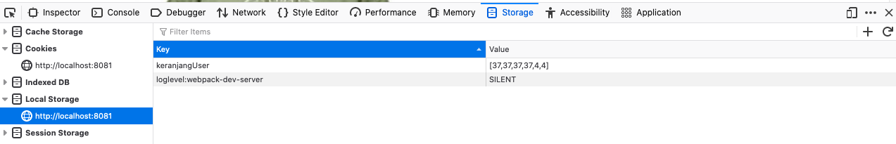

# shayna-vue

## Project setup
```
npm install
```

### Compiles and hot-reloads for development
```
npm run serve
```

### Compiles and minifies for production
```
npm run build
```

### Lints and fixes files
```
npm run lint
```

### install axios
```
npm install axios
```

## LOCAL STORAGE

- template
```html
<a @click="saveKeranjang(productDetails.id)"  href="#" class="primary-btn pd-cart"> Add To Cart </a>
```

- script
```js
// methods
saveKeranjang(idProduct, nameProduct){
    this.keranjangUser.push(idProduct);
    const parsed = JSON.stringify(this.keranjangUser);
    localStorage.setItem('keranjangUser', parsed);
}

// mounteds
if(localStorage.getItem('keranjangUser')) {
    try {
        this.keranjangUser = JSON.parse(localStorage.getItem('keranjangUser'));
    } catch (error) {
        localStorage.removeItem('keranjangStorage');
    }
}
```

- output
<p align="center">

</p>


### Customize configuration
See [Configuration Reference](https://cli.vuejs.org/config/).
